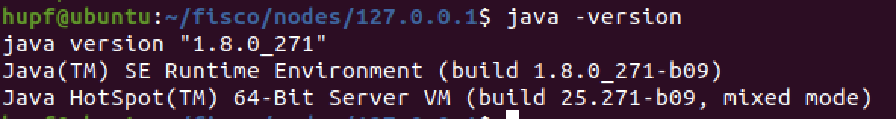
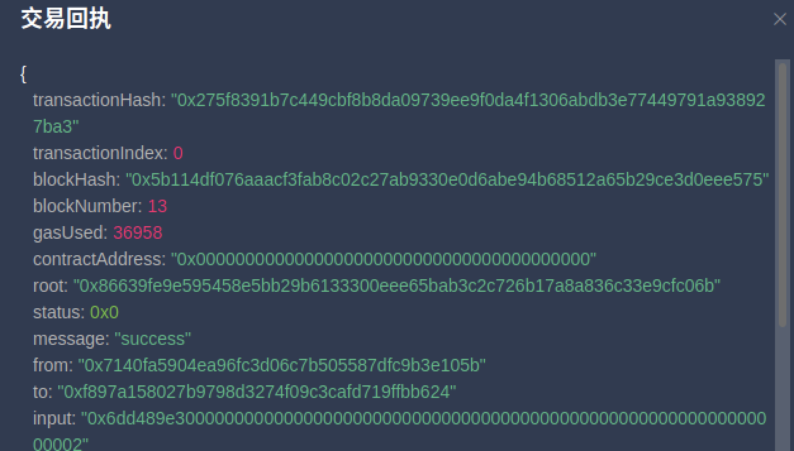

# 功能测试文档

## 个人信息

| 课程名称 | 区块链原理与技术 |   任课老师   |      黄华威      |
| :------: | :--------------: | :----------: | :--------------: |
|   年级   |      2018级      | 专业（方向） |   软件工程专业   |
|   学号   |     18342025     |     姓名     |      胡鹏飞      |
|   电话   |   13944589695    |    Email     | 945554668@qq.com |

## WeBASE 搭建

为了方便合约的编译和部署，我按照[文档](https://fisco-bcos-documentation.readthedocs.io/zh_CN/latest/docs/installation.html#fisco-bcos)中的方法进行部署 `WeBASE` 环境，成功部署该环境就可以在本地的浏览器中方便地进行查看区块，节点，以及交易的数量；合约的编写、编译与部署。

### 实验环境

Ubuntu 20.04.1

### java环境配置

其实在第一次热身报告的时候我就尝试搭建 `WeBASE` 环境，但是当初搭建的过程中一直报错，后来发现是 `java` 的版本的问题。官网上搭建 `java` 环境的过程是不准确的，应该去官网上下载对应版本的 `java` ，并且配置好 `JAVA_HOME` 等路径才可以正常启动。`JAVA_HOME` 路径的配置官网上是正确的，`JAVA` 版本如下：



配置好的 `JAVA` 路径如下：


## 配置 WeBASE

做完前期工作就可以进行正常配置了。首先找到自己的工作目录运行以下命令：

`wget https://osp-1257653870.cos.ap-guangzhou.myqcloud.com/WeBASE/releases/download/v1.4.2/webase-front.zip`

下载好压缩包后进行解压：

`unzip webase-front.zip`

拷贝sdk证书文件（build_chain的时候生成的）

将节点所在目录`nodes/${ip}/sdk`下的ca.crt、node.crt和node.key文件拷贝到conf下

做好以上的工作即可进行运行此服务，目录中有 `start.sh` 文件，该文件就是启动 `WeBASE` 的文件，运行以下命令：

`bash start.sh`

**注意**：在启动之前要启动相关的节点

如果出现以下信息则表示成功启动

```
===============================================================================================
Server com.webank.webase.front.Application Port 5002 ...PID(8137) [Starting]. Please check message through the log file (default path:./log/).
===============================================================================================

```

### 启动WeBASE

在浏览器中输入 `http://localhost:5002/WeBASE-Front ` 即可成功启动，启动的效果如下所示：


## 功能测试

选择合约管理中的合约IDE即可添加自己写好的智能合约，并且可以保存和编译，如果没有问题则会显示如下：


由上图可知该智能合约编写成功。

 在合约列表中也可以查看刚刚部署好的合约：


各种功能的测试可以通过点击右上角的合约调用从而选择方法，增加参数即可：


### 创建用户

首先需要在用户中选择增加三个用户分别代表核心公司(from)，见证方(witness)以及收款方(to)：


### 功能一：

实现采购商品—签发应收账款 交易上链。例如车企从轮胎公司购买一批轮胎并 签订应收账款单据。

选择合约调用方法中的 `AddContract`，按照提示输入相关的信息 ：


点击确认后得到的结果如下图所示：


### 功能二

实现应收账款的转让上链，轮胎公司从轮毂公司购买一笔轮毂，便将于车企的应 收账款单据部分转让给轮毂公司。轮毂公司可以利用这个新的单据去融资或者要求车企到期时归还钱款。 

在方法中选择 `Transfer`，添加相关数据即可进行功能测试：


点击确认后得到的结果如下图所示：


可以得知功能成功实现

### 功能三

利用应收账款向银行融资上链，供应链上所有可以利用应收账款单据向银行申请融资。 

在方法中选择 `Finacing`，添加相关数据即可进行功能测试：


点击确认后得到的结果如下图所示：



最后观察 `datas` 中的 `isFinacing` 变量，可以观察到已经成功从之前的 `false` 变成了 `true` 则证明功能成功实现：


此时再测试该单据是否可以进行转让：


由上图可以发现返回的信息是该单据已经被融资也对应了代码中的：

```c
  require(
    !receipts[receiptID].isFinancing,
    "该单据已经被融资！"
  );
```

### 功能四

应收账款支付结算上链，应收账款单据到期时核心企业向下游企业支付相应的欠款。

在方法中选择 `Finish`，添加相关数据即可进行功能测试：


点击确认后得到的结果如下图所示：


最后观察 `datas` 中的 `isFinish` 变量，可以观察到已经成功从之前的 `false` 变成了 `true` 则证明功能成功实现：


再次选择该单据进行结算，看看是否报错：


可以看到有返回的提示信息 `该单据已经结算`，也对应了相关的代码：

```c
require(
  !receipts[receiptID].isFinish,
  "该单据已经结算！"
);
```

至此所有功能成功测试并且正常实现。
