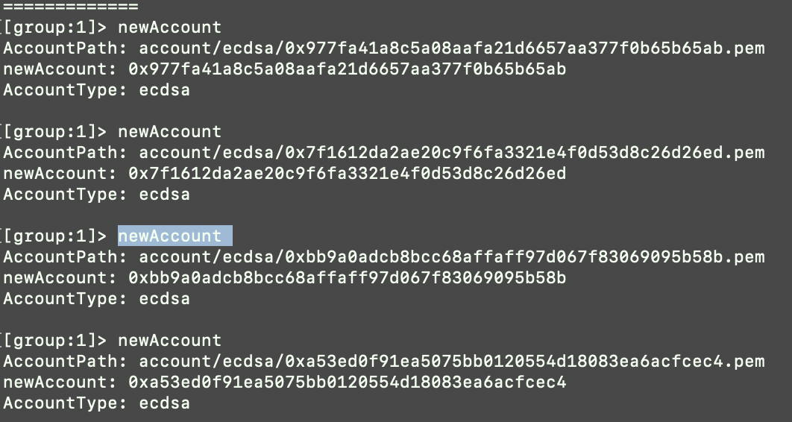

# 期末大作业实验报告

## 个人信息

| 课程名称 | 区块链原理与技术 |   任课老师   |      黄华威      |
| :------: | :--------------: | :----------: | :--------------: |
|   年级   |      2018级      | 专业（方向） |   软件工程专业   |
|   学号   |     18342025     |     姓名     |      胡鹏飞      |
|   电话   |   13944589695    |    Email     | 945554668@qq.com |

## 程序运行说明

程序运行说明请见：[README.md](./README.md)

## 前端实现

**前端的代码实现请见**：[FrontEnd](./FrontEnd)

由于在本学期的中级实训中，我担任的就是前端开发的工作，使用的语言是 Vue。所以我也将那个项目的一些成果套用过来，来实现本实验的前端工作。本次大作业的前端我是以官方项目 `iview admin` 为基础进行实现的：

以该项目为基础的原因是，该项目的显示比较美观且组件功能完善，只需要讲所需要的功能设计出来即可。

运行前端后，在跳出的浏览器中输入任意密码即可登录。

点击右侧的栏目 `供应链金融`，即可进入功能展示页面：

我用了按钮和表格的形式了完成四个功能的实现与展示：

本次实验要求的四个基本功能对应了表格上方的四个按钮，点击不同按钮，会实现不同的功能。

最后单据的展示，分为单据类型、单据ID、核心公司（发起方）、收款方、见证方以及金额。这样可以清晰地看到单据的详情信息。

## 后端实现

**后端的代码实现请见**：[BackEnd](./BackEnd)

后端实现主要是参考了官方给出的后端框架：[传送门](https://fisco-bcos-documentation.readthedocs.io/zh_CN/latest/docs/sdk/nodejs_sdk/index.html)

照着官网上的配置信息，将框架进行修改，再将自己写好的智能合约部署到后端即可正常运行，在 `conf` 目录中也需要更改相应的链端代码的位置：

## 链端实现

**链端的代码实现请见**：[ChainEnd](./BackEnd/packages/cli/conf/ChainEnd)

在运行好链端后，需要添加四个用户，以便后续项目的使用，打开控制台：

`cd console`

`bash start.sh`

然后输入命令 `newAccount `，即可创建新的用户，并且返回了用户的地址：

## 功能测试

### 功能一：

实现采购商品—签发应收账款 交易上链。例如车企从轮胎公司购买一批轮胎并 签订应收账款单据。

点击第一个按钮：`交易上链`

在输入框中输入指定的信息：

交易成功后会有交易成功的提示框，并且在表格中也会显示相应地信息：

### 功能二

实现应收账款的转让上链，轮胎公司从轮毂公司购买一笔轮毂，便将于车企的应 收账款单据部分转让给轮毂公司。轮毂公司可以利用这个新的单据去融资或者要求车企到期时归还钱款。 

点击第二个按钮：`转让上链`

在输入框中输入指定的信息：

转让成功后会有转让成功的提示框，并且在表格中也会显示相应地信息：

### 功能三

利用应收账款向银行融资上链，供应链上所有可以利用应收账款单据向银行申请融资。 

点击第三个按钮：`融资上链`

在输入框中输入指定的信息：

融资成功后会有融资成功的提示框，并且在相应的后端命令框中也会显示相应地信息：

### 功能四

应收账款支付结算上链，应收账款单据到期时核心企业向下游企业支付相应的欠款。

点击第四个按钮：`结算上链`

在输入框中输入指定的信息：

结算成功后会有结算成功的提示框，并且在相应的后端命令框中也会显示相应地信息：

至此所有功能成功测试并且正常实现。

## 实验总结

本次期末大作业实现起来也是比较繁琐，需要自行实现前端和后端的任务，还需要自行学习新语言的语法。通过不断的查阅资料，并且寻求往届学长的帮助，也是成功实现了本次大作业。

本次大作业也是对区块链这门课的一次综合实验，涉及到了许多区块链的专业知识，在通过代码实现后，可以更加清楚这些知识。很感谢老师与助教一个学期的付出，让我学到了很多关于区块链的专业的知识，也对这方面的内容产生了极大的兴趣，也希望今后自己可以在这个方向有更大的进步。本次作业的提交时间也拖的比较晚，也辛苦老师和助教在寒假期间也要为我们批改作业。最后给老师和助教拜个早年，新年快乐！