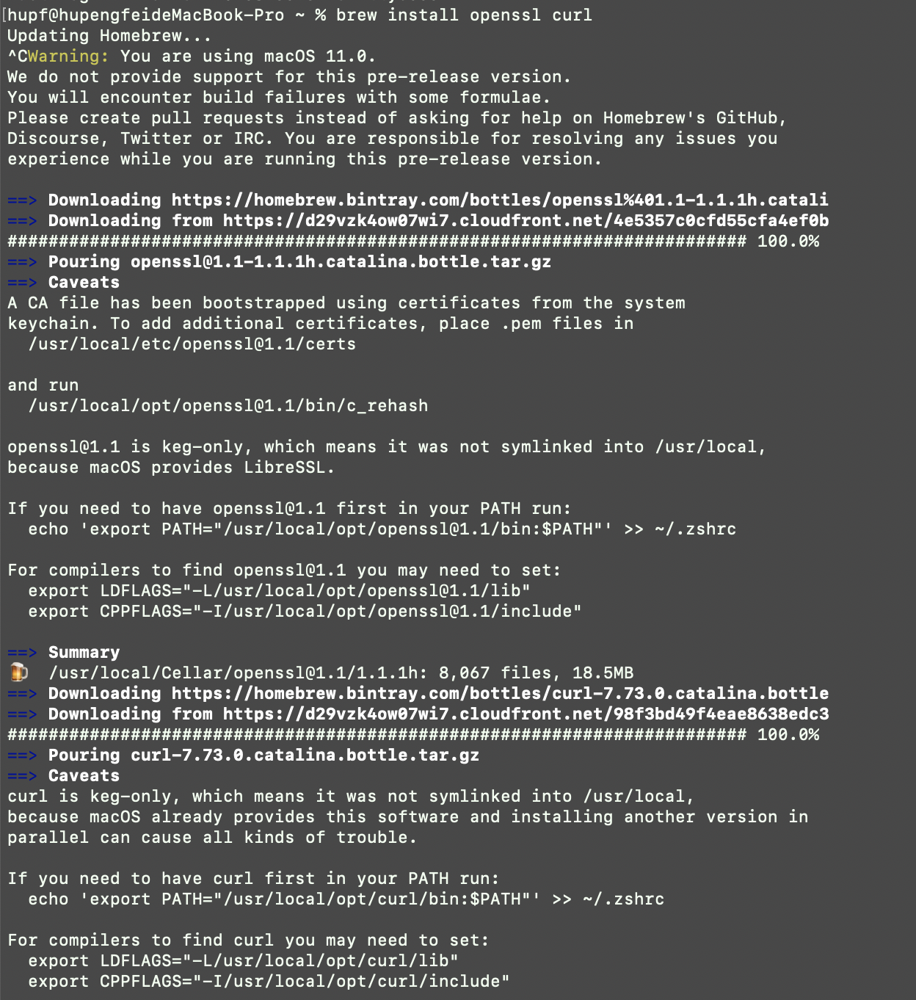

## 18342025\_胡鹏飞_热身报告

- [阶段要求](#阶段要求)
- [实验环境](#实验环境)
- [实验过程](#实验过程)
  - [私有链的搭建](#私有链的搭建)
  - [配置使用控制台](#配置使用控制台)
  - [新节点的加入](#新节点的加入)
  - [编写智能合约](#编写智能合约)
  - [命令查看区块](#命令查看区块)
- [实验总结](#实验总结)

## 阶段要求

- 使用已有的开源区块链系统FISCO-BCOS，完成私有链的搭建以及新节点的加入。（截图说明搭建流程）

- 自行编写一个智能合约并部署到私有链上，同时完成合约调用。（截图说明部署流程）

- 使用命令查看一个区块，并对各个字段进行解释。

## 实验环境

操作系统：macOS Big Sur 11.0.1

## 实验过程

本次实验过程都是按照 `FISCO BCOS` 官方文档的步骤进行环境搭建及实验的进行，官方文档链接：[传送门](https://fisco-bcos-documentation.readthedocs.io/zh_CN/latest/docs/installation.html)

### 私有链的搭建

- 开发部署的工具 `build_chain.sh` 依赖 `openssl, curl` ，根据以下命令安装依赖：

  `brew install openssl curl`



​		由上图可知成功安装好了依赖环境

- 然后需要创建 `fisco` 操作目录，并且下载安装脚本

  ```
  ## 创建操作目录
  cd ~ && mkdir -p fisco && cd fisco
  
  ## 下载脚本
  curl -#LO https://github.com/FISCO-BCOS/FISCO-BCOS/releases/download/v2.7.0/build_chain.sh && chmod u+x build_chain.sh
  ```

  

- 安装好脚本后，开始搭建单群组四节点的联盟链，还需要确保 `30300~30303，20200~20203，8545~8548`端口没有被占用。在 mac 中用以下的命令即可进行检测端口的使用情况：

  `lsof -i:端口号`

  

  由上图可知该端口并没有被占用，所以可以开始配置：

  `bash build_chain.sh -l 127.0.0.1:4 -p 30300,20200,8545`

  

  命令执行成功会输出 `All completed`。

- 接下来就启动 `FISCO BCOS` 链：

  `bash nodes/127.0.0.1/start_all.sh`

  成功启动会有下面的提示信息：

  

- 启动后开始检查进程：

  `ps -ef | grep -v grep | grep fisco-bcos`

  可以发现有四个进程数目，说明启动成功

  

### 配置使用控制台

- 首先需要配置 `java` 环境，即在 [java 官网](https://www.java.com/zh-CN/) 中可以下载

  

  配置好环境后需要获取控制台，命令如下：

  `cd ~/fisco && curl -#LO https://github.com/FISCO-BCOS/console/releases/download/v2.7.0/download_console.sh && bash download_console.sh`

  

  成功获取控制台后，需要配置控制台的文件，和控制台证书：

  ```
  # 最新版本控制台使用如下命令拷贝配置文件
  cp -n console/conf/config-example.toml console/conf/config.toml
  
  cp -r nodes/127.0.0.1/sdk/* console/conf/
  ```

  

- 接下来可以启动并使用控制台：

  `cd ~/fisco/console && bash start.sh`

  这里我在第一遍尝试的时候发现并不可以成功启动：

  

  后来发现是 `java` 版本的问题，后来重新装了 `java` 可以成功运行：

  

  不输成功后可以简单进行命令的测试，看看是否能够成功使用：

  

### 新节点的加入

- 首先获取证书生成新的脚本：

  `curl -#LO https://raw.githubusercontent.com/FISCO-BCOS/FISCO-BCOS/master/tools/gen_node_cert.sh`

  

  然后需要生成新节点私钥证书：

  `bash gen_node_cert.sh -c ../cert/agency -o newNode`

  

- 然后需要准备配置文件，需要拷贝 `node0` 中的配置文件与脚本工具到新的节点中

  ```
  cp node0/config.ini newNode/config.ini
  cp node0/conf/group.1.genesis newNode/conf/group.1.genesis
  cp node0/conf/group.1.ini newNode/conf/group.1.ini
  cp node0/*.sh newNode/
  cp -r node0/scripts newNode/
  ```

  更新 `newNode/config.ini` 中监听的 IP 和端口，对于 `[rpc]` 模块，修改 `listen_ip`、`channel_listen_port` 和 `jsonrpc_listen_port`；对于 `[p2p]` 模块，修改 `listen_port`

  

  将新节点的 P2P 配置中的 IP 和 Port 加入原有节点的 `config.ini` 中的 [p2p] 字段。

  然后启动新的节点，观察情况：

  `newNode/start.sh`

  

  然后进行查看新节点的 `NodeID` ：

  `cat newNode/conf/node.nodeid`

  

  通过控制台发现新的节点在列表中:

  

  然后我们将新的节点加入到公式节点中

  

  发现插入成功，然后观察公式节点，发现确实如此：

  

  至此成功插入新的节点

### 编写智能合约

- 首先编写一个简单的 `HelloWorld` 合约，该合约提供两个接口，分别是 `get()` 和 `set()`，用于获取/设置合约变量 `name`。合约内容如下:

```go
pragma solidity ^0.4.24;

contract HelloWorld {
    string name;

    function HelloWorld() {
        name = "Hello, World!";
    }

    function get()constant returns(string) {
        return name;
    }

    function set(string n) {
        name = n;
    }
}
```

- 成功写好了合约后，可以进行命令的部署，部署成功后即刻返回合约的地址：

  

  可以看到成功部署了该合约

- 然后开始调用该合约，应 `call` 命令来调取两个接口 `get` 和 `set` 

  - `get 接口`：

    

  - `set 接口`：

    

  成功调用合约中的两个接口后，变量是否改变：

  

  可以发现成功部署智能合约，并且实现了合约的调用。

### 命令查看区块

- `getBlockNumber`：查看区块的高度
- `getBlockHeaderByHash`根据区块哈希查询区块头信息
  - `dbHash`：主要是用来比较MongoDB数据是否一致
  - `extraData`：字符串。当前块的extra data字段。
  - `gasLimit`：Number，当前区块允许使用的最大gas。
  - `gasUsed`：当前区块累计使用的总的gas。
  - `hash`：字符串，区块的哈希串。当这个区块处于 pending 将会返回 null。
  - `logsBloom`：字符串，区块日志的布隆过滤器。当这个区块处于 pending 将会返回 null。
  - `number`：区块号。当这个区块处于 pending 将会返回 null。
  - `parentHash`：字符串，32字节的父区块的哈希值
  - `receiptsRoot`：存储的是交易回执内容
  - `sealer`：共识节点
  - `sealerList`：共识节点列表
  - `stateRoot`：字符串，32字节。区块的最终状态前缀树的根。
  - `timestamp`：Number，区块打包时的 unix 时间戳。
  - `transactionsRoot`：字符串，32字节，区块的交易前缀树的根。
- `getBlockHeaderByNumber`：根据区块高度查询区块头信息(与上面重复的不再解释)
  - `transactions`：数组。交易对象。或者是32字节的交易哈希。
- `getBlockByHash`：根据区块哈希查询区块信息
- `getBlockByNumber`：根据区块高度查询区块信息
- `getBlockHashByNumber`：通过区块高度获取区块的哈希值

## 实验总结

本次实验是对环境的基础配置，以及对于控制台各种命令的掌握。以及一些操作如私有链的搭建过程，新节点的加入过程，部署智能合约并且完成合约调用。对于区块的各个字段也有初步的了解。由于老师说 mac 端在后续的实验中可能会有 bug，所以我在 Centos 和 Ubuntu 上都配置好了环境，以便后续的进展。下一步计划是完成各个功能的测试。