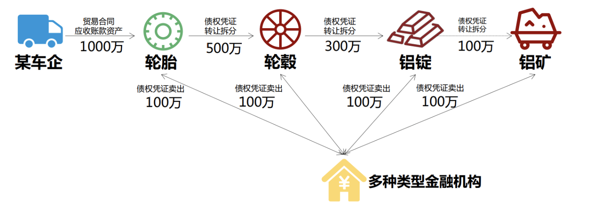

# 项目设计说明

## 个人信息

| 课程名称 | 区块链原理与技术 |   任课老师   |      黄华威      |
| :------: | :--------------: | :----------: | :--------------: |
|   年级   |      2018级      | 专业（方向） |   软件工程专业   |
|   学号   |     18342025     |     姓名     |      胡鹏飞      |
|   电话   |   13944589695    |    Email     | 945554668@qq.com |

## 项目地址

[Github](https://github.com/hupf3/blockChain)

## 项目背景



**传统供应链金融:**

某车企(宝马)因为其造车技术特别牛，消费者口碑好，所以其在同行业中占据绝对优势 地位。因此，在金融机构(银行)对该车企的信用评级将很高，认为他有很大的风险承担的 能力。在某次交易中，该车企从轮胎公司购买了一批轮胎，但由于资金暂时短缺向轮胎公司 签订了 1000 万的应收账款单据，承诺 1 年后归还轮胎公司 1000 万。这个过程可以拉上金 融机构例如银行来对这笔交易作见证，确认这笔交易的真实性。在接下里的几个月里，轮胎 公司因为资金短缺需要融资，这个时候它可以凭借跟某车企签订的应收账款单据向金融结构 借款，金融机构认可该车企(核心企业)的还款能力，因此愿意借款给轮胎公司。但是，这 样的信任关系并不会往下游传递。在某个交易中，轮胎公司从轮毂公司购买了一批轮毂，但 由于租金暂时短缺向轮胎公司签订了 500 万的应收账款单据，承诺 1 年后归还轮胎公司 500 万。当轮毂公司想利用这个应收账款单据向金融机构借款融资的时候，金融机构因为不认可 轮胎公司的还款能力，需要对轮胎公司进行详细的信用分析以评估其还款能力同时验证应收 账款单据的真实性，才能决定是否借款给轮毂公司。这个过程将增加很多经济成本，而这个 问题主要是由于该车企的信用无法在整个供应链中传递以及交易信息不透明化所导致的。 

**区块链+供应链金融:**

将供应链上的每一笔交易和应收账款单据上链，同时引入第三方可信机构来确认这些信 息的交易，例如银行，物流公司等，确保交易和单据的真实性。同时，支持应收账款的转让， 融资，清算等，让核心企业的信用可以传递到供应链的下游企业，减小中小企业的融资难度。

## 功能实现

- 功能一：实现采购商品—签发应收账款 交易上链。例如车企从轮胎公司购买一批轮胎并 签订应收账款单据。

- 功能二：实现应收账款的转让上链，轮胎公司从轮毂公司购买一笔轮毂，便将于车企的应 收账款单据部分转让给轮毂公司。轮毂公司可以利用这个新的单据去融资或者要求车企到期时归还钱款。 

- 功能三：利用应收账款向银行融资上链，供应链上所有可以利用应收账款单据向银行申请融资。 
- 功能四：应收账款支付结算上链，应收账款单据到期时核心企业向下游企业支付相应的欠款。

## 细节设计

### 数据结构

本次实验主要包含了两个数据结构 `Company` 和 `Receipt` 分别是公司的结构体，和收据的结构体

- `Company`：公司应该包括它的地址；根据本次的项目的背景，将公司分成了三类核心公司，见证方也就是银行；还有一类是收款方：

  ```c
  // 公司的结构体
  struct Company{
    address addr;   // 地址
    uint type_t;      // 公司类别 0:核心 1:见证（银行）2:收款
  }
  ```

- 在本次项目中还有一个非常重要的结构体是收据的结构体。收据应该包含 `int` 类型的收据的单号，金额，以及剩余的价值；也需要保存见证方的地址，发起方的地址和收款方的地址；还需要判断该收据是否融资以及是否结算；并且通过一个数组来统计它的交易记录

  ```c
  // 收据的结构体
  struct Receipt{
  
    uint receiptID;         // 收据的单号
    uint money;             // 金额
    uint val;               // 剩余价值
  
    address witness;        // 见证方地址
    address from;           // 发起方地址
    address to;             // 收款方地址
  
    bool isFinancing;       // 是否融资
    bool isFinish;          // 是否结算
  
    uint[] records;         // 交易记录
  
  }
  ```

本次实验还用到了一些全局变量：

- 为了让代码写起来更加方便，定义了一个映射关系，也就是地址能直接映射到公司：

  ```c
  // 地址映射公司
  mapping(address => Company) public companys;
  ```

- 需要统计已经在链上的公司有哪些：

  ```c
  // 已经在链上的公司
  Company[] public companysInChain;
  ```

- 还需要统计单据的信息：

  ```c
  // 单据
  Receipt[] public receipts;
  ```

### 代码说明

在 `sol` 中有一种用法是定义一个事件，并且在函数中能够触发这个事件，具体的操作如下：

```c
event a(); // 定义
...
emit a(); // 触发
```

在本次项目中也需要定义一个这个事件，方便操作，该事件实现的内容是创建或者更新一个新的单据，自然参数就是单据中的各个成员变量，也多了一个判断是创建还是更新的参数：

```c
// 定义一个事件，创建或者更新一个新的单据
event newReceipt(string type_t, uint receiptID, uint money, uint val, address witness, address from, address to, bool isFinancing, bool isFinish, uint[] records);
```

接下来就是针对四个功能设计的四个函数来分别进行实现：

- 功能一：实现采购商品—签发应收账款 交易上链。例如车企从轮胎公司购买一批轮胎并 签订应收账款单据。

  功能一实际就是添加一个合约，需要使得公司，见证方，收款方三方入链，

  ```c
  // 公司入链
  companysInChain.push(Company(core, 0));
  companys[core] = companysInChain[0];
  
  // 见证方入链
  companysInChain.push(Company(witness, 1));
  companys[witness] = companysInChain[1];
  
  // 收款方入链
  companysInChain.push(Company(payee, 2));
  companys[payee] = companysInChain[2];
  ```

  

  以及将新建的单据也加入到链中。

  ```c#
  // 单据入链
  receipts.length ++;
  receipts[receipts.length - 1].receiptID = receipts.length;
  receipts[receipts.length - 1].money = money_t;
  receipts[receipts.length - 1].val = money_t;
  
  receipts[receipts.length - 1].witness = witness;
  receipts[receipts.length - 1].from = core;
  receipts[receipts.length - 1].to = payee;
  
  receipts[receipts.length - 1].isFinancing = false;
  receipts[receipts.length - 1].isFinish = false;
  
  // 新的单据
  emit newReceipt("new", receipts[receipts.length - 1].receiptID, receipts[receipts.length - 1].money, receipts[receipts.length - 1].val, receipts[receipts.length - 1].witness, receipts[receipts.length - 1].from, receipts[receipts.length - 1].to,  receipts[receipts.length - 1].isFinancing, receipts[receipts.length - 1].isFinish, receipts[receipts.length - 1].records);
  ```

- 功能二：实现应收账款的转让上链，轮胎公司从轮毂公司购买一笔轮毂，便将于车企的应 收账款单据部分转让给轮毂公司。轮毂公司可以利用这个新的单据去融资或者要求车企到期时归还钱款。 

  该功能在实现前需要进行判断单据是否已经被融资，以及单据的金额是否足够，如果不足够的话就会跑出异常

  ```c
  // 抛出异常
  require(
    !receipts[receiptID].isFinancing,
    "该单据已经被融资！"
  );
  
  // 抛出异常
  require(
    receipts[receiptID].val >= money_t,
    "单据金额不够！"
  );
  ```

  并且需要判断该公司是否在链上，如果没有在链上则将收款方入链，并且定义好公司的类型：

  ```c
  // 判断是否在链上
  bool flag = false;
  for (uint i = 0; i < companysInChain.length; i ++) {
    if (companysInChain[i].addr == payee) {
      flag = true;
      break;
    }
  }
  // 收款方入链
  if (!flag) {
    companysInChain.push(Company(payee, 2));
    companys[payee] = companysInChain[companysInChain.length - 1];
  }
  ```

  此时需要创建一个新的单据，并且将新的单据加入到链中：

  ```c
  // 将单据入链
  receipts.length ++;
  receipts[receipts.length - 1].receiptID = receipts.length;
  receipts[receipts.length - 1].money = money_t;
  receipts[receipts.length - 1].val = money_t;
  
  receipts[receipts.length - 1].from = receipts[receiptID].to;
  receipts[receipts.length - 1].to = payee;
  
  receipts[receipts.length - 1].isFinancing = false;
  receipts[receipts.length - 1].isFinish = false;
  
  // 新的单据
  emit newReceipt("new", receipts[receipts.length - 1].receiptID, receipts[receipts.length - 1].money, receipts[receipts.length - 1].val, receipts[receipts.length - 1].witness, receipts[receipts.length - 1].from, receipts[receipts.length - 1].to, receipts[receipts.length - 1].isFinancing, receipts[receipts.length - 1].isFinish, receipts[receipts.length - 1].records);
  ```

  同时需要将旧的单据进行更新：

  ```c
  // 需要将旧的单据进行更新
  receipts[receiptID].records.push(receipts.length - 1);
  receipts[receiptID].val -= money_t;
  
  // 更新旧的单据
  emit newReceipt("fresh", receiptID, receipts[receiptID].money, receipts[receiptID].val, receipts[receiptID].witness, receipts[receiptID].from, receipts[receiptID].to,  receipts[receiptID].isFinancing, receipts[receiptID].isFinish, receipts[receiptID].records);
  ```

- 功能三：利用应收账款向银行融资上链，供应链上所有可以利用应收账款单据向银行申请融资。 

  该功能实现前依然需要判断单据是否已经被融资，如果被融资则需要抛出异常；

  ```c
  // 抛出异常
  require(
    !receipts[receiptID].isFinancing,
    "该单据已经被融资！"
  );
  ```

  否则就可以将融资状态设为 `true` 并且更新旧的单据信息：

  ```c
  // 已经融资
  receipts[receiptID].isFinancing = true;
  
  // 更新旧的单据
  emit newReceipt("fresh", receiptID, receipts[receiptID].money, receipts[receiptID].val, receipts[receiptID].witness, receipts[receiptID].from, receipts[receiptID].to,  receipts[receiptID].isFinancing, receipts[receiptID].isFinish, receipts[receiptID].records);
  
  ```

- 功能四：应收账款支付结算上链，应收账款单据到期时核心企业向下游企业支付相应的欠款。

  该功能实现前依然需要判断单据是否已经被融资，如果被融资则需要抛出异常；

  ```c
  // 抛出异常
  require(
    !receipts[receiptID].isFinish,
    "该单据已经结算！"
  );
  ```

  否则就可以将结算状态设为 `true` 并且更新旧的单据信息：

  ```c
  // 已经结算
  receipts[receiptID].isFinish = true;
  
  // 更新旧的单据
  emit newReceipt("fresh", receiptID, receipts[receiptID].money, receipts[receiptID].val, receipts[receiptID].witness, receipts[receiptID].from, receipts[receiptID].to,  receipts[receiptID].isFinancing, receipts[receiptID].isFinish, receipts[receiptID].records);
  ```

## 实验总结

这些功能实现起来其实并不是很困难，只要能够看懂题目的背景，并且学习一下该语言的一些用法，了解区块链的工作流程，问题就能够迎刃而解了，但是还是有的功能有些不完善，需要自己在第三阶段完善，并且做出交互更好的前端和后端。

